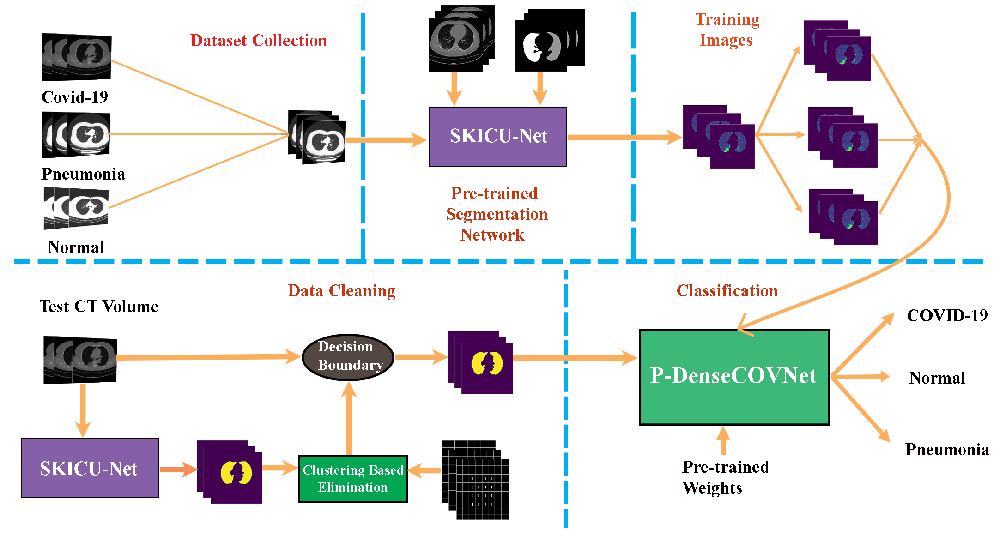
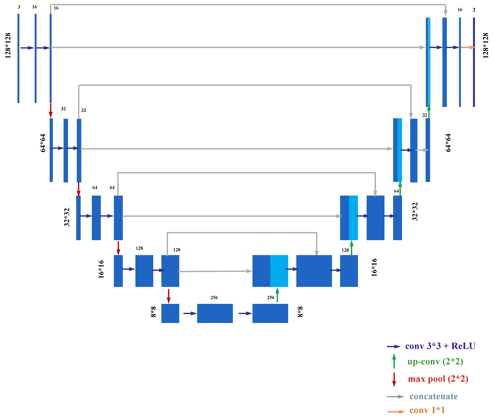

# Dual Stage Deep Convolutional Neural Network for Automatic diagnosis of COVID-19 and Pneumonia from Chest CT Images

# Abstract :
In  the  Coronavirus  disease-2019  (COVID-19)  pandemic,  for  fast  and  accurate  diagnosisof a large number of patients, besides traditional methods, automated diagnostic tools are now extremelyrequired. In this paper, a deep convolutional neural network (CNN) based scheme is proposed for automatedaccurate  diagnosis  of  COVID-19  from  lung  computed  tomography  (CT)  scan  images.  First,  for  theautomated segmentation of lung regions in a chest CT scan, a modified CNN architecture, namely SKICU-Net is proposed by incorporating additional skip interconnections in the U-Net model that overcome theloss  of  information  in  dimension  scaling.  Next,  an  agglomerative  hierarchical  clustering  is  deployed  toeliminate the CT slices without significant information. Finally, for effective feature extraction and diagnosisof COVID-19 and pneumonia from the segmented lung slices, a modified DenseNet architecture, namely P-DenseCOVNet is designed where parallel convolutional paths are introduced on top of the conventionalDenseNet  model  for  getting  better  performance  through  overcoming  the  loss  of  positional  arguments.Outstanding performances have been achieved with anF1score of 0.97 in the segmentation task alongwith an accuracy of87.5%in diagnosing COVID-19, common pneumonia, and normal cases. Significantexperimental  results  and  comparison  with  other  studies  show  that  the  proposed  scheme  provides  verysatisfactory performances and can serve as an effective diagnostic tool in the current pandemic.

# Pipeline:

# SKICU-Net(Skip Connected U-net Architecture):

# Unsupervised hierarchical Clustering:
X,Y axis represent centric features and frontier features of the images after performing segmentation.
